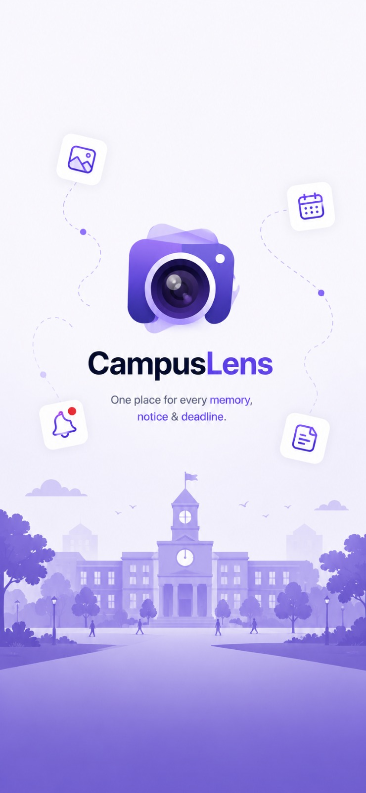
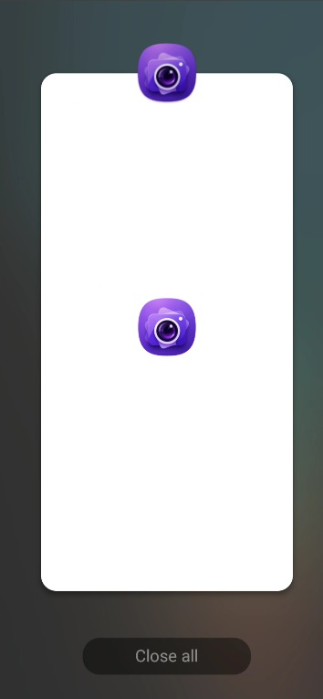

# 📌 Campus Lens

**Your personal deadline assistant — for a campus life that's scattered across a dozen apps.**

Hackathon announcements land in WhatsApp groups. Project deadlines get buried in Gmail. Club event details show up as a forwarded link nobody reads properly. Campus Lens pulls all of that into one place — just forward a message or paste a link, and it reads the content for you and turns it into a deadline you won't miss.

---

## 😩 The Problem

If you're a student juggling hackathons, assignments, and project submissions, your deadlines don't live in one app — they're scattered across:

- WhatsApp group messages and forwards
- Gmail (event mailers, submission portals, faculty emails)
- Random links shared in Discord/Telegram

Nothing reminds you until it's almost too late.

## 💡 The Idea

Campus Lens is a lightweight mobile assistant that does one thing really well: **extract deadlines from messy, unstructured content and remind you before they slip by.**

1. **Share** — Forward a WhatsApp message, paste a Gmail snippet, or drop a link into the app.
2. **Analyze** — Campus Lens reads the content and extracts what matters: event/project name, deadline, and key details.
3. **Remind** — It's added to your dashboard with a timely reminder, so you never have to dig through chats again.

---

## 📱 Screenshots

<p align="center">
  
  &nbsp;&nbsp;
  
</p>

---

## ✨ Features

- 📩 **Share-to-extract** — send any text, forwarded message, or link straight into the app
- 🧠 **Smart extraction** — automatically pulls out deadlines, titles, and context from unstructured text
- ⏰ **Deadline reminders** — get notified before a hackathon or project due date sneaks up on you
- 📋 **One dashboard** — every deadline from every scattered source, in a single view

> More features (like direct WhatsApp/Gmail integrations) are on the roadmap — see below.

---

## 🛠️ Tech Stack

- [Expo](https://expo.dev) + React Native
- TypeScript
- [NativeWind](https://www.nativewind.dev/) (Tailwind CSS for React Native)
- Expo Router (file-based routing)

---

## 🚀 Getting Started

1. **Clone the repo**

   ```bash
   git clone https://github.com/Naren456/campus-lens.git
   cd campus-lens
   ```

2. **Install dependencies**

   ```bash
   npm install
   ```

3. **Start the app**

   ```bash
   npx expo start
   ```

   From the output, open the app in a:
   - [Development build](https://docs.expo.dev/develop/development-builds/introduction/)
   - [Android emulator](https://docs.expo.dev/workflow/android-studio-emulator/)
   - [iOS simulator](https://docs.expo.dev/workflow/ios-simulator/)
   - [Expo Go](https://expo.dev/go) sandbox

---

## 🤝 Contributing

Contributions, issues, and feature requests are welcome! Feel free to check the [issues page](https://github.com/Naren456/campus-lens/issues).

## 📄 License

This project is licensed under the [MIT License](./LICENSE).